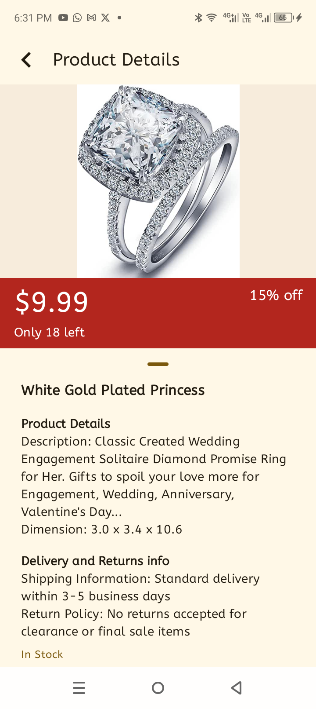

# Spark Shop
An ecommerce application that offers different categories of products and allows users to buy from it

## Languages, libraries and tools used
* Kotlin
* Jetpack compose
* Coil - image loading
* Hilt - dependency injection
* Retrofit
* Room database
* KotlinX serializer
* Flow: SharedFlow, StateFlow

## How to run the project
* Download the latest android studio
* Clone the project from github using this command `git clone https://github.com/segunfrancis/Spark-Shop.git`
* Open the project in android studio
* Run the project on an emulator or a physical device

## Architecture
* This project makes use of MVVM architecture.
* The **data layer** is responsible communicating with the rest API. This layer is made up of 2 other layers - `Remote` and `Local`
* The `Local` layer is the single source of truth of the UI. The data is gotten from the endpoint and then cached to the room database. Before this is done, a check is done on the database. 
* The caching strategy:
  * When the app is opened, the content of the database is observed and displayed on the UI. If the database is empty, a network call is made. When the data is gotten, it is set to the database which automatically reflects on the UI because the data is returned as a `Flow`
* Endpoints:
    * `/products`: A GET request that returns a list of products
* The **ViewModel** handles the UI logic. It transforms the `Flow` to a `StateFlow` which is shown on the UI or an event in the form of a `SharedFlow`.
* The **Composables** render the UI

## Screenshots

### API 28

  
  
  
  

### API 33

  
  
  
  

